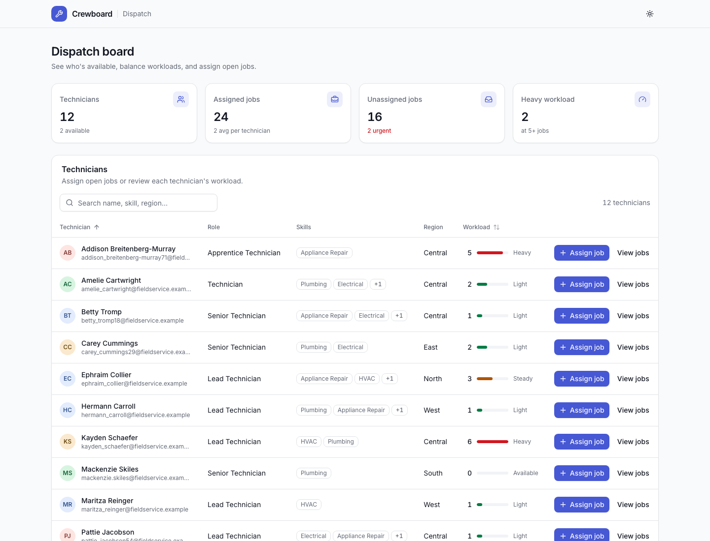
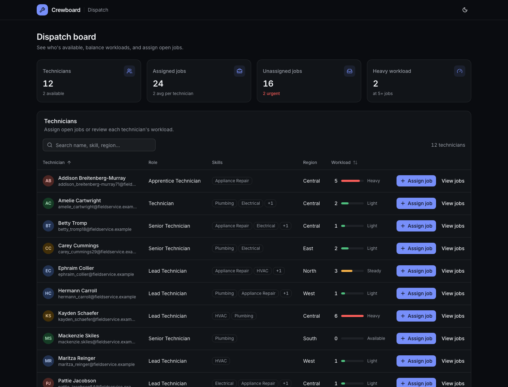

# Crewboard

A dispatch board for a field-service company: see every technician, the jobs each one holds and how loaded they are, then assign or unassign jobs. All data lives in Postgres and is seeded with realistic fake technicians and jobs.

| Light | Dark |
|---|---|
|  |  |

## Stack

| Layer | Tech |
|---|---|
| Web | React 19, TypeScript, Vite, TanStack Query, TanStack Table |
| Design system | Tailwind CSS v4 with semantic light/dark tokens, shadcn/ui-style components on Radix, lucide icons, Inter, sonner toasts |
| API | Node, Express 5, TypeScript, Zod |
| Database | Postgres 17 (Docker Compose), Prisma 7 |
| Tests | Jest, Testing Library, Supertest against a real test database; GitHub Actions CI |

## Getting started

Prerequisites: Node.js 22+ (see `.nvmrc`) and Docker.

```bash
npm install
cp apps/api/.env.example apps/api/.env
npm run setup   # start Postgres, generate the Prisma client, migrate, seed
npm run dev     # API and web app with hot reload
```

Open http://localhost:5176. The API listens on http://localhost:8003 and the web dev server proxies `/api` to it.

### Ports

Crewboard avoids the usual defaults so it can run next to other local stacks.

| Service | Default | Override |
|---|---|---|
| Postgres (host) | 5435 | `POSTGRES_PORT=5440 npm run db:up`, then update both URLs in `apps/api/.env` |
| API | 8003 | `PORT` in `apps/api/.env` |
| Web | 5176 | `API_PROXY_TARGET` points the dev proxy at a different API URL |

## Scripts

Run from the repository root.

| Command | What it does |
|---|---|
| `npm run dev` | Run the API and web app together |
| `npm run setup` | `db:up`, generate the Prisma client, `db:migrate`, `db:seed` |
| `npm run db:up` / `db:down` | Start / stop the Postgres container |
| `npm run db:migrate` | Apply migrations to `DATABASE_URL` |
| `npm run db:seed` | Wipe and re-seed technicians and jobs (deterministic) |
| `npm run db:seed:large` | Wipe and re-seed at scale: 50,000 technicians and 1,000,000 jobs ([details](#large-dataset)) |
| `npm run db:reset` | Drop everything, re-apply migrations, re-seed |
| `npm run typecheck` | Type-check both apps |
| `npm test` | API integration tests and web component tests |
| `npm run build` | Production build of the web app |

## How it works

### Data model

- **provinces**: code (primary key, e.g. `BC`), name (unique)
- **regions**: a service region within a province, e.g. British Columbia › Metro Vancouver; name (unique per province), `province_code`
- **cities**: a city within a region, e.g. British Columbia › Metro Vancouver › Surrey; name (unique per region), `region_id`
- **skill_categories**: name (unique), e.g. Appliance Repair
- **skills**: a specialty within a category, e.g. Appliance Repair › Refrigerators; name (globally unique), `category_id`
- **technicians**: name, email (unique), phone, designation, home base (`city_id`), `active_job_count`; specialties through **technician_skills** (`technician_id`, `skill_id`)
- **jobs**: title, description, customer, address, job site (`city_id`), required specialty (`skill_id`), priority (`LOW`, `MEDIUM`, `HIGH`, `URGENT`), scheduled date, status (`OPEN`, `ASSIGNED`, `COMPLETED`, `CANCELLED`), nullable `technician_id`, `assigned_at`, `completed_at`

A technician has many jobs and a job has at most one technician, so the foreign key lives on `jobs`. A job's lifecycle is its status: `OPEN` jobs wait for a technician, `ASSIGNED` jobs are held by one, and `COMPLETED` or `CANCELLED` jobs are closed history (a completed job keeps its technician and `completed_at`). A technician's load is the number of `ASSIGNED` jobs they hold, so history never inflates it. The status sets live in `apps/api/src/job-status.ts`.

The load is stored as `technicians.active_job_count` rather than counted per request: every assign and unassign moves it in the same transaction as the job update, and only when the job actually changed state, so conflicts and no-ops never touch it. Bulk writes (the seed, test fixtures) call `recomputeActiveJobCounts` from `apps/api/src/workload-counter.ts` afterwards.

Indexes are sized for tens of thousands of technicians and a million jobs, and all declared in `schema.prisma`:

- **jobs**: `(status, technician_id)`, `(status, scheduled_date, priority)`, `(skill_id, status)`, `(city_id, status)`, `(technician_id)`
- **technicians**: `(name, id)` and `(active_job_count, name, id)` for keyset pagination, `(city_id)`
- Trigram GIN indexes (the `pg_trgm` extension, enabled by the migration) on technician name and email and on job title and customer name, for `ILIKE '%term%'` search

The seed creates a service geography for a company headquartered in British Columbia with branches in Alberta: 2 provinces, 6 regions and 22 cities (British Columbia › Metro Vancouver, Fraser Valley, Capital Region, Central Okanagan; Alberta › Calgary Region, Edmonton Region). It adds 7 skill categories with 30 specialties, 28 technicians (16 based in Metro Vancouver) with a deliberately uneven workload and 2–5 specialties from one or two categories each, and 88 active jobs (52 assigned, 36 open, spread across every region). Job addresses use real street names and postal code prefixes for their city. Assigned jobs always require a specialty the technician has and are usually in the technician's region. On top of that it adds history: 113 completed jobs (2–6 per technician over the last 120 days, never before their hire date) and 8 cancelled jobs.

The shared reference data and the builders both seeds use live in `apps/api/prisma/seed-data.ts`.

Technicians include `specialties: { id, name, category: { id, name } }[]` (sorted by category, then specialty) and jobs include `skill: { id, name, category: { id, name } }`. Both include `location: { city: { id, name }, region: { id, name }, province: { code, name } }`: a technician's home base or a job's site. The older `skills` (specialty names), `requiredSkill` (specialty name) and technician `region` (home base city name) fields are still returned.

### Large dataset

`npm run db:seed:large` replaces the dataset with a Canada-wide one to develop and demo against at scale: by default 50,000 technicians and 1,000,000 jobs, over the same geography and skill taxonomy as the dev seed.

```bash
npm run db:seed:large                                       # 50,000 technicians, 1,000,000 jobs
npm run db:seed:large -- --technicians 2000 --jobs 50000    # any size you like
```

Reach for it to check indexes, query plans and the UI against realistic volumes; `npm run db:seed` stays the seed for everyday work, and the counts above describe that small dataset. Both seeds wipe what came before, so switching between them is one command.

Everything except the reference data is generated inside Postgres from `generate_series`, so the default run takes well under a minute on a laptop instead of the many minutes a row-by-row script would need. It prints the row counts and how long each step took, and runs `ANALYZE` at the end so the planner has fresh statistics. A rerun with the same flags produces the same data; only the row ids change.

The mix is deliberately uneven:

- **Technicians** spread over every region, weighted to Metro Vancouver (48% of the crew, 82% in British Columbia), with 2–5 specialties concentrated in one or two categories and hire dates over the last 15 years.
- **Jobs** are 92% `COMPLETED` over the last three years, 4% `ASSIGNED`, 3% `OPEN` backlog and 1% `CANCELLED`. Assigned and completed jobs always require one of their technician's specialties, 85% of them are in the technician's own region and the rest elsewhere in the same province, and none of them predate the technician's hire date.
- **Workloads** run 0–8 assigned jobs, held by about a quarter of the crew, and `active_job_count` matches them exactly: the script finishes by running `recomputeActiveJobCounts` and fails if it finds a single counter to correct.

The list endpoints still return whole tables, so the web app can't take the full default dataset yet: `GET /api/technicians` fails for 50,000 technicians (`P2029`, more bind parameters than Postgres accepts) and `GET /api/jobs` answers with about 60 MB. Seed a few thousand technicians when you want to drive the UI.

### API

| Method | Route | Purpose |
|---|---|---|
| GET | `/api/health` | API and database health |
| GET | `/api/technicians` | Technicians with `assignedJobCount` (`ASSIGNED` jobs only) and `hiredOn`, sorted by name |
| GET | `/api/technicians/:id` | One technician, in the same shape as a list item |
| GET | `/api/jobs` | Active (`OPEN` and `ASSIGNED`) jobs, by scheduled date, then priority |
| GET | `/api/jobs?unassigned=true` | `OPEN` jobs |
| GET | `/api/jobs?technicianId=<uuid>` | `ASSIGNED` jobs held by one technician |
| PATCH | `/api/jobs/:id/assignment` | `{ "technicianId": "<uuid>" }` assigns, `{ "technicianId": null }` unassigns |

Jobs include `status` and `completedAt`.

Errors always use `{ "error": { "code", "message" } }`: `400 VALIDATION_ERROR` / `BAD_REQUEST`, `404 JOB_NOT_FOUND` / `TECHNICIAN_NOT_FOUND`, `409 JOB_ALREADY_ASSIGNED` / `JOB_CLOSED`.

Assigning moves an `OPEN` job to `ASSIGNED` with a conditional update on `status = 'OPEN' AND technician_id IS NULL`, so when two dispatchers assign the same job at once exactly one wins and the other gets `409 JOB_ALREADY_ASSIGNED`. Unassigning moves an `ASSIGNED` job back to `OPEN` and is idempotent for a job that is already open. Completed and cancelled jobs can't be assigned or unassigned (`409 JOB_CLOSED`).

### Web app

- **Dispatch board**: stat cards (technicians and how many are free, assigned jobs, unassigned jobs with the urgent count, technicians at a heavy workload) above a searchable, sortable technicians table with a workload meter per person.
- **Assign job** opens a dialog of unassigned jobs, with jobs matching the technician's skills ranked first, then by priority and date.
- **View jobs** opens a side sheet with the technician's details and assigned jobs, each with **Unassign**.
- After every change the table, stats, sheet and dialog refetch; a job someone else just took shows the conflict inside the dialog.

Workload levels: 0 jobs Available, 1–2 Light, 3–4 Steady, 5+ Heavy.

### Frontend architecture

- **Tokens** (`apps/web/src/index.css`): semantic OKLCH colors for light (`:root`) and dark (`.dark`), mapped into Tailwind. Components only use tokens such as `bg-card` or `text-muted-foreground`, which is what makes both themes work. Contrast is checked against WCAG AA.
- **Theming**: `ThemeProvider` follows the OS or a saved Light/Dark/System choice; a small script in `index.html` applies it before first paint so there is no flash.
- **Components**, in layers: `components/ui` (owned primitives on Radix and class-variance-authority) → `components/dashboard` (domain components with explicit props) → `DispatchBoard`, which owns state and data.
- **Data**: `lib/api.ts` (typed client, `ApiError`) and `lib/queries.ts` (TanStack Query hooks; mutations invalidate technicians and jobs on settle).

## Testing

- **API**: Jest + Supertest against a real Postgres database. `TEST_DATABASE_URL` is migrated once per run and reset to a small known fixture before every test, including a concurrent-assignment race.
- **Web**: Jest + Testing Library, querying by role and accessible name. `App.test.tsx` drives the whole board against an in-memory API.
- **CI**: every pull request runs type-checking, both test suites against a Postgres service, and the web build.

## Project structure

```
apps/
  api/
    prisma/            schema, migrations, seeds
    src/routes/        health, technicians, jobs
    test/              integration tests and fixtures
  web/
    src/components/    ui, dashboard, layout, theme
    src/lib/           api client, queries, formatting, workload
docker-compose.yml     Postgres
docker/postgres/init/  creates the test database on first start
.github/workflows/     CI
```

## Out of scope

Authentication, creating or editing technicians and jobs, reassigning a job in one step, capacity or hours-based load, and scheduling.
